  

  <strong>Backend Engineer & AI Enthusiast</strong> 
  Building scalable backends and integrating AI into real-world systems.

 

## About Me

I'm a developer who loves connecting **AI** with **Backend Engineering** to create practical, production-ready solutions.

Currently focused on:

- **LLM Agents & RAG** — designing retrieval-augmented pipelines and autonomous agent workflows
- **Scalable Backend Architecture** — building robust APIs and distributed systems
- **MLOps & AI Integration** — bridging the gap between research and deployment

---

## Tech Stacks

### Language & Framework

  
  
  
  

### AI & Data

  
  
  

### Infrastructure & Database

  
  
  
  
  

---

## Projects

| Project                                                                 | Description                                               | Stack                                  |
| ----------------------------------------------------------------------- | --------------------------------------------------------- | -------------------------------------- |
| **[CCTV-Streaming](https://github.com/leeseoin/cctv_streaming_webRTC)** | Real-time CCTV streaming system with WebRTC & PTZ control | Java, Spring Boot, go2rtc, WebRTC, HLS |
| **[KobWeb_Project](https://github.com/leeseoin/kobweb_project)**        | Web application built with Kobweb framework               | Spring Boot, RAG, LLama.cpp, FastAPI   |

---

## GitHub Stats

  
  

---

## Contact

  
  

  

